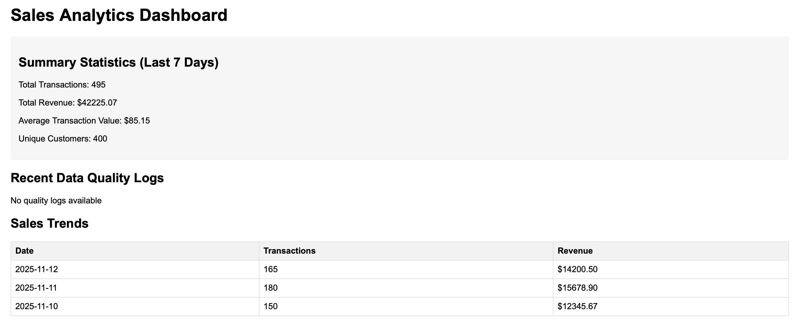

# Sales Analytics ETL Pipeline (AWS + Python + Flask)

A fully functional **cloud ETL pipeline** built with **AWS Lambda, S3, RDS Postgres, CloudWatch**, and a **Flask Dashboard** for data visualization.

Designed to showcase skills for **AE / DA / DE** roles:
- Data ingestion & validation  
- Cloud pipeline automation  
- SQL-based analytics  
- Monitoring & alerting  
- Dashboard development  

---

# 🚀 Architecture

**Pipeline Summary**
1. Raw sales CSV files uploaded to **S3**  
2. **AWS Lambda** triggers on upload  
3. Data is cleaned & validated → written into **PostgreSQL RDS**  
4. Metrics (daily revenue, top categories) are written to a reporting table  
5. Dashboard pulls processed metrics and renders interactive charts  
6. **CloudWatch** logs & alerts monitor latency and failures  

---

# 📊 Features

### ✔ Automated ETL
- Lambda parses raw CSV  
- Cleans missing values, normalizes fields  
- Inserts into fact + analytics tables  
- Generates daily metrics  

### ✔ Dashboard (Flask)

- Daily revenue line chart  
- Category breakdown pie chart  
- Filter by date  
- Served locally or via Docker  

### ✔ AWS Monitoring & Alerting
- Lambda error alerts (SNS)  
- CloudWatch latency dashboard  
- Log insights queries for debugging  

---

# 🛠 Tech Stack

| Layer | Tools |
|------|-------|
| Cloud | AWS Lambda, S3, RDS Postgres, CloudWatch, IAM |
| Backend | Python, psycopg2, Pandas |
| Dashboard | Flask, HTML/CSS, Chart.js |
| Data | SQL, ETL, Data Modeling |

---

# 📁 Repository Structure

